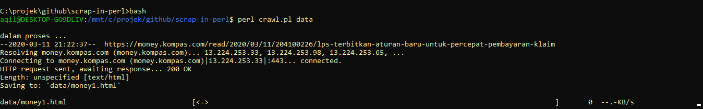
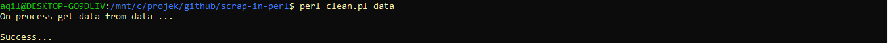

# Scrap in Perl

## Run Program
- Run crawl : `perl crawl.pl ./data`

- Run clean : `perl clean.pl ./data`

## Requirement
- perl
- [DateTime](https://metacpan.org/pod/DateTime)
- [HTML::ExtractContent](https://metacpan.org/pod/HTML::ExtractContent)
- [WWW::Mechanize](https://metacpan.org/pod/WWW::Mechanize)

